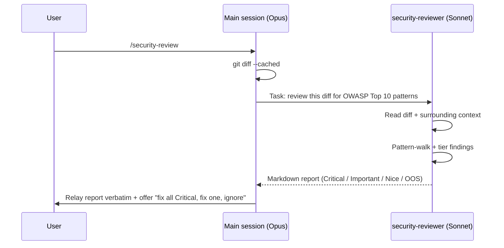

# /security-review

## When to use

- Before committing changes that touch authentication, authorization,
  cryptography, user-input handling, file/path operations, request handling
  (routes/middleware/templates), or anything that reads/writes secrets.
- When the `security-nudge` Stop hook prints a one-liner suggestion.
- Whenever you want a second pair of eyes on a diff before pushing —
  Sonnet running on isolated context will catch things Opus inline missed
  about a third of the time in informal testing.

## What it does NOT replace

- **Static analysis** (Semgrep, CodeQL, Bandit) — those have rule sets
  built by full-time security teams. Run them separately in CI.
- **Dependency vulnerability scanning** (`npm audit`, `pip-audit`,
  `cargo audit`, GitHub Dependabot). The skill flags suspicious package
  additions but does not check CVE feeds.
- **A real pentest.** This is a diff review by a model, not an attacker
  exercising your live system.

## How it runs

1. Main session reads the staged diff (`git diff --cached`; falls back to
   `git diff` if nothing staged).
2. If diff is empty, report "no changes to review" and stop.
3. **Task** `subagent_type: generalPurpose` to the bundled `security-reviewer` persona
   (read-only). Pass:
   - The full diff
   - The list of changed files
   - The current branch and `git log --oneline -5` for context
4. Receive the structured Markdown report.
5. Relay the report **verbatim** to the user. Do not paraphrase, summarize,
   or pre-emptively fix anything.
6. Ask the user: "Fix all Critical findings, address one specific finding,
   or commit as-is and address later?"

## Hard rules for the main session

- **Never modify code from this skill's invocation.** This skill is purely
  audit + relay. If the user says "yes, fix the Critical findings," that's
  a separate main-session step — exit this skill first.
- **Never silently downgrade tiers.** If the subagent reported a finding
  as Critical, surface it as Critical. The user decides priority.
- **Always relay the full report.** Do not trim the "Out of scope" section
  — it tells the user what wasn't covered.

## Why a subagent, not inline

The benchmark series in `bench/archive-token-savings-thesis/` showed that
subagent dispatch is usually a cost loss vs Opus inline. We accept that
cost here because:

1. **Deterministic output schema.** Sonnet returns Critical/Important/Nice
   tiers every invocation; Opus inline produces prose of varying shape.
   Downstream tooling (e.g., a CI gate that only blocks on Critical) can
   parse the structured output.
2. **Context isolation.** A read-only subagent cannot accidentally "fix"
   findings mid-review — eliminating the class of bugs where the reviewer
   becomes the implementer.
3. **Cost-not-amortized work.** Security review is naturally bounded (one
   diff in, one report out). It doesn't benefit from main-session warm
   cache the way iterative coding does.

If you want to skip the dispatch and have Opus inline read the diff and
emit a report freeform, just type "review this diff for security issues"
without invoking the skill — the model will do it. The skill exists for
the cases above (schema, isolation, structured-output workflows).

## Codex parity

The same skill ships in Codex via `scripts/install-codex.sh`. The
subagent is at `.codex/agents/security-reviewer.toml` (generated from
`agents/security-reviewer.md` by `scripts/gen-codex-agents.py`).

## Tunables

- The `security-nudge` Stop hook fires when net-new code crosses
  **80 LOC** and at least one changed file matches a sensitive-path
  pattern (`*auth*`, `*login*`, `routes/`, `api/`, `*crypto*`,
  `*payment*`, `templates/`, `*.env*`, …). Override threshold via env
  var `CLAUDE_LEVERAGE_SECURITY_NUDGE_LOC`.
